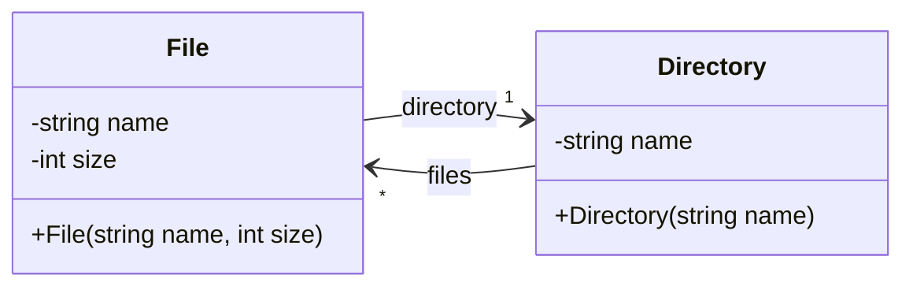
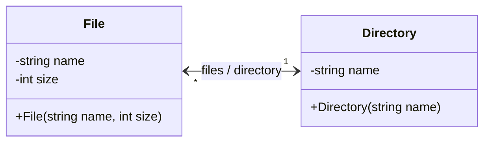

# Example: Bidirectional Association - Directory

This example shows an implementation of a bidirectional association with
multiplicities 1 and *.

## Class diagram



Two opposite directed associations can be combined into a bidirectional
association.



Conversely, a bidirectional association can be represented as two
opposite directed associations.

## Implementations

Example: Directed association with multiplicity `1` from `File` to
`Directory`

```C++
// File ---[1]-> Directory
private:
    Directory* _directory = nullptr;

public:
    Directory* directory(void) const;
    void directory(Directory* directory);
```

This is the standard implementation for a directed association with
multiplicity `1`: A private pointer field with a corresponding getter and
setter.

_Example:_ Directed association with multiplicity `*` from `Directory` to
`File`

```C++
// Directory ---[*]-> File
private:
    std::vector<File*> _files;

public:
    void addFile(File* file);
    File* file(int index);
    int numberOfFiles(void) const;
```

Here, a `std::vector` plus simple management methods provide a **standard
implementation for a multiplicity `*` association**.


_Example:_ Navigation between `Directory` and `File` objects

```C++
TEST_F(DirectoryTest, ConstructorTest) 
{
    // Navigation: Directory -> File
    EXPECT_EQ("TODO.txt", student->file(0)->name());
    EXPECT_EQ(1024, student->file(0)->size());
    
    // Navigation: Directory -> File -> Directory
    EXPECT_EQ("/home/student", student->file(0)->directory()->name());
}
```

*Egon Teiniker, 2024-2025, GPL v3.0*  