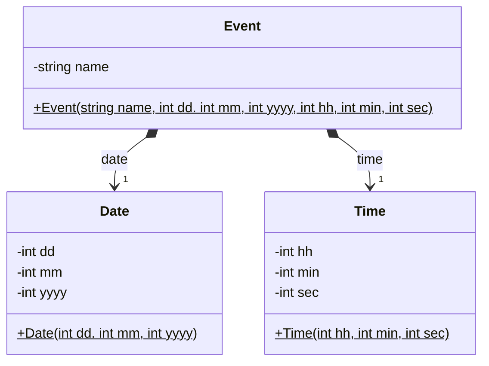

# Example: Composition - Event

This example demonstrates composition, the “has-a” relationship where 
**one class owns instances of another***. 

## Class diagram



The lifecycles of `Date` and `Time` objects are directly tied to the
lifetime of `Event` objects. When an `Event` is created, it owns its
`Date` and `Time` instances; when the Event is destroyed, those instances
are destroyed as well.


## Implementations

Example: Compositions with multiplicity `1` from `Event` to
`Date` and `Time`

```C++
// Composition: Event --[1]-> Time
// Composition: Event --[1]-> Date
private:
    Time* _time; 
    Date* _date; 

public:
    Event::Event(string name, int dd, int mm, int yyyy, int hh, int min, int sec)
        : _name{name}
    {
        _date = new Date(dd, mm, yyyy);
        _time = new Time(hh, min, sec);
    }

    Event::~Event(void)
    {
        delete _date;
        delete _time;
    }
```

The implementation of compositions is a good example of the **Resource
Acquisition Is Initialization (RAII)** concept in C++:
* The **constructor** instantiates the required objects
* The **destructor** deletes those objects again

This ensures that resources are managed correctly and without errors.

_Example:_ Creating an `Event` object which results in creating three
objects.

```C++
TEST(EventTestGroup, EventTest)
{
    Event event = Event("SW Design Lecture", 1, 4, 2020, 8, 45); // sec=0
    
    // Verify
    EXPECT_EQ("Event{'SW Design Lecture': Date[01.04.2024] Time[08:45:00]}", event.to_string());
}
```

From the outside, it is not apparent whether an `Event` is a single object
or the composition of three objects.

*Egon Teiniker, 2024-2025, GPL v3.0*  