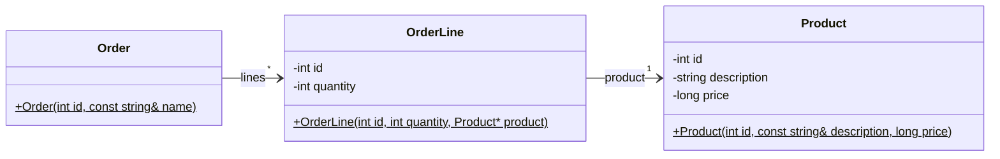

# Example: Directed Association - Product

This example shows the implementation of directed associations with
multiplicities `1` and `*`.

## Class Diagram 




## Implementations

_Example:_ Directed association with multiplicity `1` (and `0..1` - optional) 
```c++
// OrderLine ---[0..1]-> Product
private:
    Product* _product;  

public:
    OrderLine(int id, int quantity, Product* product);
    Product* product(void) const;
```

In this example the `Product` reference is set in the constructor and can
only be read afterwards. Optionally, a setter method could be provided to
change this reference.

With these implementations, it is possible to navigate from an object to its
associated objects. This allows traversing associations in the object model.


_Example:_ Directed association with multiplicity `*` (many) 

```c++
// Order ---[*]-> OrderLine
private:
    std::vector<OrderLine*> _lines;  

public:
    void addLine(OrderLine* line);
    OrderLine* line(int index);
    int numberOfLines(void);
```

Here, a `std::vector` is used to store the changing number of references to
`OrderLine` objects.

The methods for managing these references can be implemented in different
ways.


_Example:_ Navigate between objects 
```c++

TEST_F(OrderTest, Product1Test) 
{
    Product* p1 = order->line(0)->product();
    EXPECT_EQ(1, p1->id());
    EXPECT_EQ("Pizza Frutti di Mare", p1->description());
    EXPECT_EQ(880, p1->price());
}
```

*Egon Teiniker, 2024-2025, GPL v3.0*  